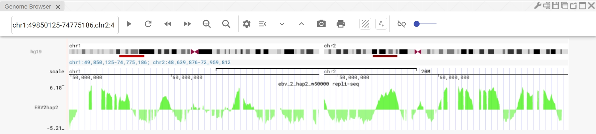

## Tutorial on visualizing replication timeing data on Nucleome Browser

### Data preprocessing

Suppose we start from bedgraph file `ebv_2_hap2_w50000.bg`, we need to first convert it to the standard bigwig file. You will need bedGraphToBigWig program. You can get bedGraphToBigWig program from UCSC Genome Browser kenUtils [https://github.com/ENCODE-DCC/kentUtils](https://github.com/ENCODE-DCC/kentUtils). You do not need to compile and install all the programs in the library. You just the bedGraphToBigWig in the **bin** folder. You will also need a chromosome size file for the species. In this example, this is hg19.genome file. Bedtools has provided those for human and mouse [https://github.com/arq5x/bedtools/tree/master/genomes](https://github.com/arq5x/bedtools/tree/master/genomes).

```
# convert bedgraph into sorted bedgraph file and fix the issue with chromosome name
cat ebv_2_hap2_w50000.bg | sort -k1,1 -k2,2n | awk '{printf("chr%s\t%s\t%s\t%s\n", $1, $2, $3, $4)}' >ebv_2_hap2_w50000.bg.sort
# convert bedgraph into bigwig file
bedGraphToBigWig ebv_2_hap2_w50000.bg.sort hg19.genome ebv_2_hap2_w50000.bw
```

### Install NucleServer
Open this link [https://github.com/nucleome/nucleserver/releases/download/v0.1.9/](https://github.com/nucleome/nucleserver/releases/download/v0.1.9/)in your web browser, and choose the right version that matches with your operating system. For Mac and Linux, you can use `nucleserver_0.1.9_linux_amd64.tar.gz`. 

```
# create a folder called NucleServer
mkdir NucleServer
cd NucleServer
# download the binary program 
wget https://github.com/nucleome/nucleserver/releases/download/v0.1.9/nucleserver_0.1.9_linux_amd64.tar.gz
# uncompress the file
tar -zxvf nucleserver_0.1.9_linux_amd64.tar.gz 
# make nucleserver as a runnable program
chmod 755 nucleserver
# back to parent folder
cd ..
```

### Prepare Nucleome Browser configuration file
The configure file is an Excel file or a Google Spreadsheet. We recommend using Google Spreadsheet because it is stored in the cloud and easier to share with others. You can view an example of Google Spreadsheet I made for the demo data [https://docs.google.com/spreadsheets/d/1LorLgN_8J-SdWf_XC6ZL_TBhijiaQ2UElFdSJ_UMgtM/edit?usp=sharing](https://docs.google.com/spreadsheets/d/1LorLgN_8J-SdWf_XC6ZL_TBhijiaQ2UElFdSJ_UMgtM/edit?usp=sharing). You can read a more detailed explanation of this Spreadsheet on the documentation site [https://nb-docs.readthedocs.io/en/latest/data_service.html#data-type-supported](https://nb-docs.readthedocs.io/en/latest/data_service.html#data-type-supported).

### Start a local data service
Copy the Google Spreadsheet Id (**1LorLgN_8J-SdWf_XC6ZL_TBhijiaQ2UElFdSJ_UMgtM**) and use it as a argument for nucleserver. You can start a local data service using the following command (**nucleserver start**). **-i** is the Google Spreadsheet ID or the path to local excel file. Here **-p** indicates the port number. This number will be used later. You can use any ports not occupied in your machine.
```
NucleServer/nucleserver start -i 1LorLgN_8J-SdWf_XC6ZL_TBhijiaQ2UElFdSJ_UMgtM -p 8888
```

### Connect to your local data service in the Nucleome Browser
Go to Nucleome Browser by typing [http://vis.nucleome.org](http://vis.nucleome.org) in your web browser. Go to the default genome browser panel or create a new genome browser panel.

Follow the documentation [https://nb-docs.readthedocs.io/en/latest/data_service.html#genomic-data](https://nb-docs.readthedocs.io/en/latest/data_service.html#genomic-data) under section **Start a data service** to connect to your local data service. 


